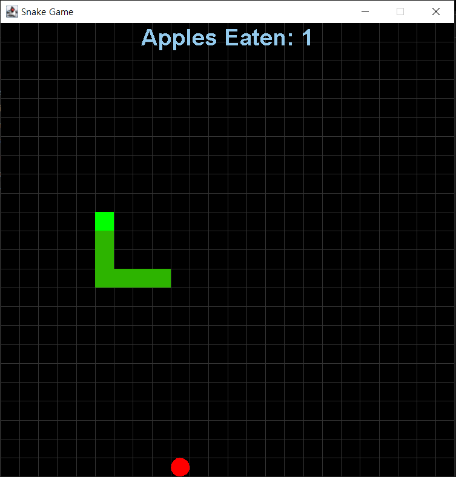

# Java Snake Game

This is a simple snake game created using the Java programming language and the Swing library. The game is played by controlling a snake that moves around the game board, eating food and growing longer with each bite. The goal is to eat as much food as possible without crashing into the walls or the snake's own body.

## Getting Started

To run the game, you will need to have the Java Development Kit (JDK) installed on your computer. You can download the JDK from the official Java website for free.

Once you have installed the JDK, you can open the project in your favorite Java IDE, such as Eclipse or IntelliJ IDEA. You can also use a text editor and compile the code using the command line.

Alternatively, you can simply double-click the "Snake_Game.jar" file that is included in the project files to launch the game. 

## How to Play

The game is played using the arrow keys on your keyboard or the WASD keys. The snake will move in the direction of the arrow key that you press. The goal is to eat as much food as possible without crashing into the walls or the snake's own body.

If the snake collides with the walls or its own body, the game is over. Your score is displayed at the end of the game as well as at the top of the canvas.

## Screenshots

Here are some screenshots of the Java Snake Game in action:

Screenshot of Snake Game in action

Screenshot of Snake Game once you lose

## Code Overview

The game consists of several classes that work together to create the game. Here's a brief overview:

- `App`: This class instantiates the `GameFrame` class and has the main method.
- `GameFrame`: This class represents the `JFrame` component, which is the basic container of the application.
- `GamePanel`: This class represents the `JPanel` component and is responsible for handling event actions as well as displaying the snake, apple, game over screen, and more.
- `utils.Direction`: This is an enum that allows us to use only the necessary directions, making switch statements more efficient.
- `model.Coordinate`: This class represents a dot or point of existence of an object. Instead of holding and keeping track of two different arrays, one object is used.

## Customization

You can customize the game by changing the values of various constants in the `GamePanel` class. For example, you can change the size of the game board, the speed of the snake, the board color, the snake's head and body color, the apple's color, and more.

## Acknowledgements

This game was created as a way to practice and improve Java skills and was inspired by the classic Snake game. The code is open-source and free to use and modify for personal and educational purposes.

## License

This project is licensed under the Apache License.

## Conclusion

That's it! You should now have a good understanding of how to play the game and how the code works. Have fun playing and feel free to modify the code to create your own version of the game. If you have any questions or feedback, please feel free to contact me.